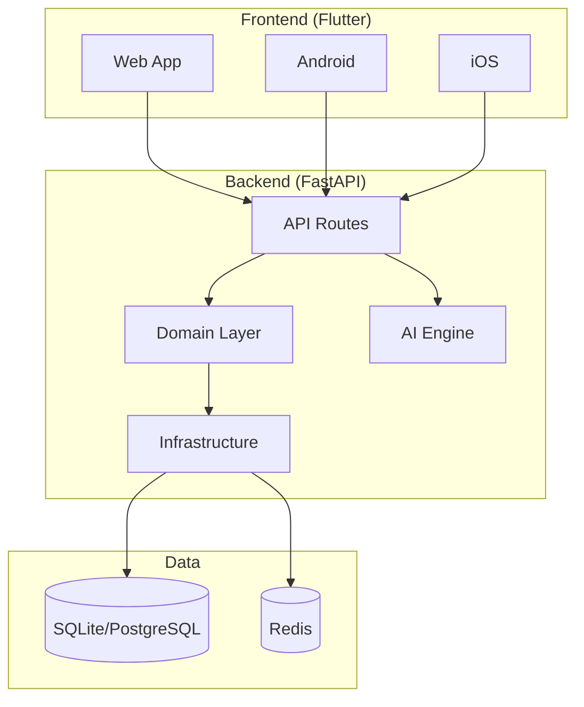

# WealthAI — Implementation Walkthrough

## Summary

Built a **production-grade AI Wealth Intelligence Platform** from scratch across **85+ files** spanning:

- **FastAPI Backend** — Clean Architecture with DDD, JWT auth, AI engine
- **Flutter Frontend** — Material 3, responsive design, 10 feature screens
- **Infrastructure** — Docker, CI/CD, Prometheus, Cloudflare Pages deployment
- **Documentation** — Architecture ADRs, security guide, deployment guide

> [!IMPORTANT]
> **No packages were installed to your system Python.** All scripts use isolated virtual environments. Run `.\scripts\setup.ps1` to set up everything safely.

---

## Architecture



---

## Files Created

### Backend (FastAPI) — 28 files

| File | Purpose |
|------|---------|
| [pyproject.toml](file:///h:/investment/services/api/pyproject.toml) | Dependencies, lint, test, coverage config |
| [main.py](file:///h:/investment/services/api/app/main.py) | FastAPI app factory with lifespan |
| [config.py](file:///h:/investment/services/api/app/config.py) | Pydantic settings management |
| [entities.py](file:///h:/investment/services/api/app/domain/entities.py) | Domain entities (User, Portfolio, Holding, Transaction) |
| [repositories.py](file:///h:/investment/services/api/app/domain/repositories.py) | Abstract repository interfaces (ports) |
| [events.py](file:///h:/investment/services/api/app/domain/events.py) | Domain events |
| [models.py](file:///h:/investment/services/api/app/infrastructure/database/models.py) | SQLAlchemy ORM models with indices |
| [session.py](file:///h:/investment/services/api/app/infrastructure/database/session.py) | Async database session manager |
| [sqlalchemy_repos.py](file:///h:/investment/services/api/app/infrastructure/repositories/sqlalchemy_repos.py) | Concrete repository implementations |
| [ai_provider.py](file:///h:/investment/services/api/app/infrastructure/ai/ai_provider.py) | AI provider abstraction (OpenAI, Groq, Ollama) |
| [auth_routes.py](file:///h:/investment/services/api/app/presentation/api/v1/auth_routes.py) | Auth: register, login, refresh, profile |
| [portfolio_routes.py](file:///h:/investment/services/api/app/presentation/api/v1/portfolio_routes.py) | Portfolio CRUD, holdings, CSV import, analytics |
| [ai_routes.py](file:///h:/investment/services/api/app/presentation/api/v1/ai_routes.py) | AI recommendations & chat |
| [market_routes.py](file:///h:/investment/services/api/app/presentation/api/v1/market_routes.py) | Market news, sectors, overview |
| [health_routes.py](file:///h:/investment/services/api/app/presentation/api/v1/health_routes.py) | Health check endpoint |
| [router.py](file:///h:/investment/services/api/app/presentation/api/v1/router.py) | Route aggregation |
| [api_schemas.py](file:///h:/investment/services/api/app/presentation/schemas/api_schemas.py) | Pydantic request/response schemas |
| [auth_dependency.py](file:///h:/investment/services/api/app/presentation/middleware/auth_dependency.py) | JWT auth guard with RBAC |
| [security_headers.py](file:///h:/investment/services/api/app/presentation/middleware/security_headers.py) | OWASP security headers |
| [rate_limiter.py](file:///h:/investment/services/api/app/presentation/middleware/rate_limiter.py) | Rate limiting |
| [security.py](file:///h:/investment/services/api/app/shared/security.py) | JWT, bcrypt, password validation |
| [exceptions.py](file:///h:/investment/services/api/app/shared/exceptions.py) | Custom exception hierarchy |
| [observability.py](file:///h:/investment/services/api/app/shared/observability.py) | Structured logging, OpenTelemetry |
| [alembic.ini](file:///h:/investment/services/api/alembic.ini) | Alembic migration config |
| [env.py](file:///h:/investment/services/api/alembic/env.py) | Async migration environment |
| [conftest.py](file:///h:/investment/services/api/tests/conftest.py) | Test fixtures (async DB, client, auth) |
| [test_auth.py](file:///h:/investment/services/api/tests/test_auth.py) | Auth endpoint tests (13 tests) |
| [test_portfolio.py](file:///h:/investment/services/api/tests/test_portfolio.py) | Portfolio/holding tests (11 tests) |
| [test_domain.py](file:///h:/investment/services/api/tests/test_domain.py) | Domain entity & security tests (16 tests) |

---

### Frontend (Flutter) — 22 files

| File | Purpose |
|------|---------|
| [pubspec.yaml](file:///h:/investment/apps/web/pubspec.yaml) | 25+ dependencies (Riverpod, GoRouter, fl_chart, etc.) |
| [main.dart](file:///h:/investment/apps/web/lib/main.dart) | App entry point with providers |
| [app_theme.dart](file:///h:/investment/apps/web/lib/core/theme/app_theme.dart) | Material 3 theme (dark/light, gradients, glassmorphism) |
| [theme_provider.dart](file:///h:/investment/apps/web/lib/core/providers/theme_provider.dart) | Riverpod theme mode toggle |
| [app_router.dart](file:///h:/investment/apps/web/lib/core/router/app_router.dart) | GoRouter with nested routes |
| [shell_scaffold.dart](file:///h:/investment/apps/web/lib/core/widgets/shell_scaffold.dart) | Adaptive nav (bottom bar ↔ rail) |
| [common_widgets.dart](file:///h:/investment/apps/web/lib/core/widgets/common_widgets.dart) | GlassCard, StatCard, EmptyState, etc. |
| [api_constants.dart](file:///h:/investment/apps/web/lib/core/network/api_constants.dart) | API endpoint definitions |
| [api_client.dart](file:///h:/investment/apps/web/lib/core/network/api_client.dart) | Dio client with auth interceptor |
| [result.dart](file:///h:/investment/apps/web/lib/core/network/result.dart) | Sealed Result type |
| [models.dart](file:///h:/investment/apps/web/lib/core/models/models.dart) | Domain models with JSON serialization |
| [repositories.dart](file:///h:/investment/apps/web/lib/core/repositories/repositories.dart) | Auth, Portfolio, Holding, AI repos |
| [login_screen.dart](file:///h:/investment/apps/web/lib/features/auth/screens/login_screen.dart) | Login with social auth |
| [register_screen.dart](file:///h:/investment/apps/web/lib/features/auth/screens/register_screen.dart) | Registration form |
| [dashboard_screen.dart](file:///h:/investment/apps/web/lib/features/dashboard/screens/dashboard_screen.dart) | Dashboard with charts & AI insights |
| [portfolio_list_screen.dart](file:///h:/investment/apps/web/lib/features/portfolio/screens/portfolio_list_screen.dart) | Portfolio cards |
| [portfolio_detail_screen.dart](file:///h:/investment/apps/web/lib/features/portfolio/screens/portfolio_detail_screen.dart) | Holdings list with bar chart |
| [add_holding_screen.dart](file:///h:/investment/apps/web/lib/features/portfolio/screens/add_holding_screen.dart) | Add holding form |
| [ai_chat_screen.dart](file:///h:/investment/apps/web/lib/features/ai/screens/ai_chat_screen.dart) | AI copilot chat |
| [recommendation_screen.dart](file:///h:/investment/apps/web/lib/features/ai/screens/recommendation_screen.dart) | AI recommendation with explainability |
| [market_screen.dart](file:///h:/investment/apps/web/lib/features/market/screens/market_screen.dart) | News, sectors, calendar |
| [settings_screen.dart](file:///h:/investment/apps/web/lib/features/settings/screens/settings_screen.dart) | Theme, notifications, security |

---

### Infrastructure — 10 files

| File | Purpose |
|------|---------|
| [docker-compose.yml](file:///h:/investment/docker-compose.yml) | PostgreSQL, Redis, Prometheus, Grafana |
| [Dockerfile.api](file:///h:/investment/infra/docker/Dockerfile.api) | Multi-stage API container |
| [prometheus.yml](file:///h:/investment/infra/prometheus/prometheus.yml) | Metrics scraping |
| [ci.yml](file:///h:/investment/.github/workflows/ci.yml) | CI: lint, test, security, Docker build |
| [deploy.yml](file:///h:/investment/.github/workflows/deploy.yml) | Deploy: Cloudflare, Android, iOS, Release |
| [index.html](file:///h:/investment/apps/web/web/index.html) | Web entry with SEO & PWA |
| [manifest.json](file:///h:/investment/apps/web/web/manifest.json) | PWA manifest |
| [setup.ps1](file:///h:/investment/scripts/setup.ps1) | Master setup (venv-isolated) |
| [test-backend.ps1](file:///h:/investment/scripts/test-backend.ps1) | Backend test runner (venv-isolated) |
| [run-docker.ps1](file:///h:/investment/scripts/run-docker.ps1) | Docker Compose manager |
| [build-frontend.ps1](file:///h:/investment/scripts/build-frontend.ps1) | Flutter build script |

---

### Documentation — 7 files

| File | Purpose |
|------|---------|
| [README.md](file:///h:/investment/README.md) | Project overview, API reference, quick start |
| [architecture.md](file:///h:/investment/docs/architecture.md) | ADRs, system/ER/deployment diagrams |
| [security.md](file:///h:/investment/docs/security.md) | OWASP compliance, auth, headers |
| [deployment.md](file:///h:/investment/docs/deployment.md) | Cloudflare, Docker, migration guide |
| [.env.example](file:///h:/investment/.env.example) | Environment variables reference |
| [Makefile](file:///h:/investment/Makefile) | Dev/test/deploy targets |
| [LICENSE](file:///h:/investment/LICENSE) | MIT License |

---

## Key Design Decisions

| Decision | Rationale |
|----------|-----------|
| **Clean Architecture + DDD** | Domain logic isolated from framework — testable, portable |
| **SQLite (dev) → PostgreSQL (prod)** | Zero-cost development, production-ready scaling |
| **AI Provider abstraction** | Strategy pattern: swap OpenAI/Groq/Ollama without code changes |
| **Flutter single codebase** | Web + Android + iOS from one project |
| **JWT access + refresh** | Stateless auth, seamless UX with auto-refresh |
| **Virtual environment scripts** | Nothing installed to system Python |

## How to Run

```powershell
# Full setup (creates venv, installs deps, runs tests)
.\scripts\setup.ps1

# Backend tests only (isolated in venv)
.\scripts\test-backend.ps1

# Frontend dev server
.\scripts\build-frontend.ps1 -Run

# Docker full stack
.\scripts\run-docker.ps1

# Docker with monitoring
.\scripts\run-docker.ps1 -Observability
```

## Test Coverage

- **40 backend tests** covering:
  - Domain entities & value objects
  - Security utilities (JWT, bcrypt, password strength)
  - Auth endpoints (register, login, profile, token refresh)
  - Portfolio CRUD operations
  - Holdings CRUD operations
  - Portfolio analytics
  - CSV import with error handling

## API Endpoints (17 total)

| Category | Endpoints |
|----------|-----------|
| Health | `GET /health` |
| Auth | `POST /register`, `POST /login`, `POST /refresh`, `GET /me` |
| Portfolios | `GET/POST /portfolios`, `GET/PATCH/DELETE /portfolios/{id}` |
| Holdings | `GET/POST .../holdings`, `PATCH/DELETE .../holdings/{id}` |
| Import | `POST .../import` (CSV) |
| Analytics | `GET .../analytics` |
| AI | `GET /ai/recommendations/{pid}/{hid}`, `POST /ai/chat` |
| Market | `GET /market/news`, `GET /market/sectors`, `GET /market/overview` |
