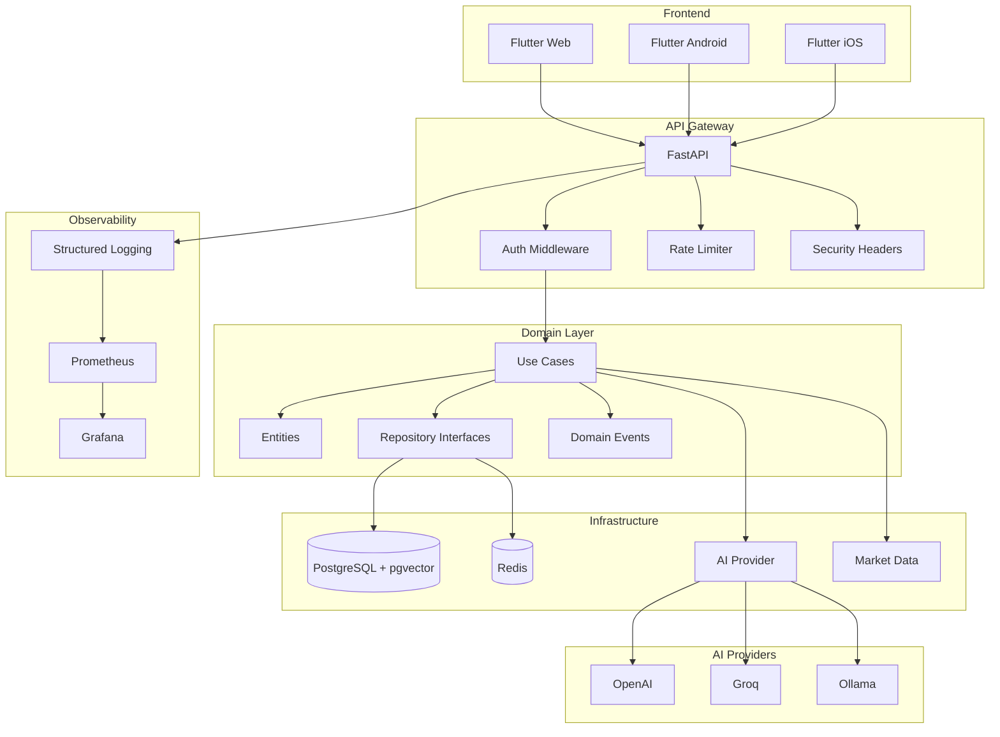
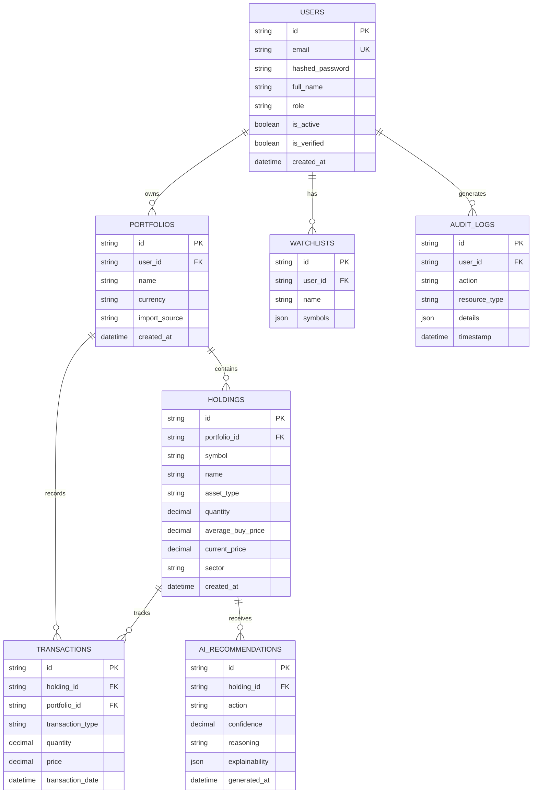
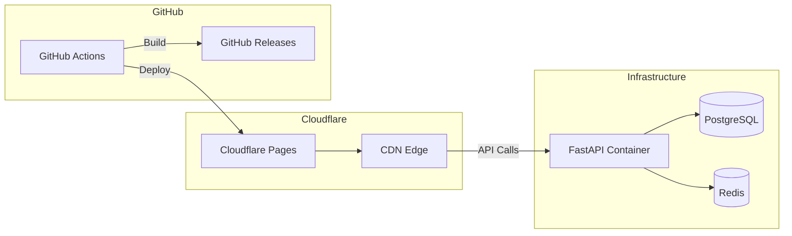

# Architecture Decision Records

## ADR-001: Clean Architecture with DDD

**Status**: Accepted  
**Date**: 2026-07-03

### Context
We need an architecture that supports:
- Modular monolith that can migrate to microservices
- Testability without infrastructure dependencies
- Clear separation of concerns
- Future extensibility

### Decision
Adopt Clean Architecture with Domain-Driven Design:
- **Domain Layer**: Pure Python entities with business logic, no framework dependencies
- **Application Layer**: Use cases orchestrating domain operations
- **Infrastructure Layer**: SQLAlchemy, AI providers, external APIs
- **Presentation Layer**: FastAPI routes, Pydantic schemas, middleware

### Consequences
- More initial boilerplate (repositories, mappers)
- Easy to test domain logic in isolation
- Swappable infrastructure (SQLite → PostgreSQL, OpenAI → Ollama)
- Clear boundaries enable future service extraction

---

## ADR-002: Flutter for Cross-Platform

**Status**: Accepted  
**Date**: 2026-07-03

### Context
Need to deploy on Web, Android, and iOS from a single codebase.

### Decision
Use Flutter with Material 3, Riverpod for state management, GoRouter for navigation.

### Consequences
- Single codebase for all platforms
- Material 3 provides consistent, modern UI
- Riverpod enables testable, predictable state management
- GoRouter provides declarative, deep-link-ready routing

---

## ADR-003: AI Provider Abstraction

**Status**: Accepted  
**Date**: 2026-07-03

### Context
Need to support multiple AI providers without vendor lock-in.

### Decision
Abstract AI providers behind a common interface (`AIProvider`):
- `OpenAICompatibleProvider`: OpenAI, Groq, Together
- `OllamaProvider`: Local LLM support

### Consequences
- Easy to add new providers
- User can choose cloud or local AI
- Consistent recommendation output regardless of provider
- Testable with mock providers

---

## ADR-004: SQLite for Development, PostgreSQL for Production

**Status**: Accepted  
**Date**: 2026-07-03

### Context
Need zero-cost initial deployment while supporting future scale.

### Decision
Use SQLite (via aiosqlite) for development and PostgreSQL (via asyncpg) for production. Database abstraction through SQLAlchemy ORM ensures portability.

### Consequences
- Zero infrastructure cost for development
- Production-ready with PostgreSQL + pgvector
- No schema changes needed between environments

---

## ADR-005: JWT Authentication with RBAC

**Status**: Accepted  
**Date**: 2026-07-03

### Context
Need stateless authentication for API and mobile apps.

### Decision
JWT with access tokens (30min) and refresh tokens (30 days).
Role-Based Access Control with admin, user, and premium roles.

### Consequences
- Stateless, scalable authentication
- Refresh tokens enable seamless UX
- RBAC enables premium features gating

---

# System Architecture Diagram

# ER Diagram

# Deployment Architecture

